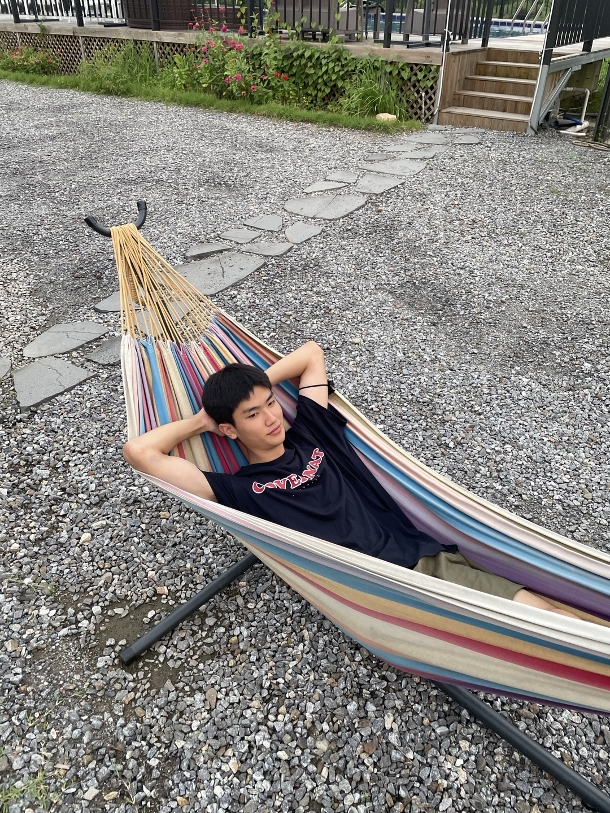

# 국민대 공유공간 플랫폼 K-SharePlace


## 🔥프로젝트 소개 및 의의

####  1️⃣문제
 현재 교내의 대다수 단과대학교에서는 공간부족 문제로 어려움을 겪고 있습니다. 몇년 째 해소되고 있지 않은 고질적인 공간부족 문제는 학생들의 다양한 활동을 제한하고 있으며, 소프트웨어융합 대학을 예로 들었을때 단과대학이 소유한 2개의 공유공간으로 8개의 동아리 중 4개의 동아리가 나눠 사용하는 것이 현실입니다.
 현재도 부족한 공유공간이지만, 2025년 교육 개정안에 따르면 단과대학 모집 정원을 축소하며 자유전공화를 통해 인재 양성 및 전공에 대한 자유도를 부여할 것으로 계획되어있습니다. 2025년 자유전공화가 이루어진다면 소프트웨어융합대학에 대한 자유전공 지원률이 가장 높아질것으로 예상되며 이는 현재보다 심각한 공유공간 부족 문제로 이어질 것입니다.
 
#### 2️⃣목표
 K-SharePlace는 공간확장이 불가능한  현 상황에서 앞서 언급한 문제를 해결하기 위해 복잡했던 강의실 대여 방식을 시스템화 시키고 공유공간 예약 서비스를 실시해 공유공간 부족 문제를 완화하고자 합니다.
 
#### 3️⃣예상되는 효과
 파손 및 도난의 우려가 있어 쉽게 대여가 안됐던 강의실 문제를 책임소재를 정확히 명시하여 올바른 대여가 가능하도록 하며 AI를 통해 관리자의 부담을 덜며 다소 까다로웠던 강의실 대영 절차를 줄여 보다 많은 학생들이 학교에 모여 함께 활동을  할 기회를 제공 할 수 있게 됩니다.
 또한 공유공간 예약 시스템을 통해 현재 공유공간을 사용하지 못하던 동아리들의 문제를 해결함과 동시에 공간을 효율적으로 배분 할 수 있게 됩니다.
 
#### 4️⃣기능 및 초안

|공간대여 선택|공유공간 선택|예약내역|예약 폼|
|---|---|---|---|
|||
반납 확인|반납 승인|채팅||
|||

 ## 🔍Abstract
#### 1️⃣Problem
 This application targets Kookmin Univ’s lack of space problem. In our university there are no tools to make a reservation of share space. It makes our colleagues hard to have a group activity. So our team made a application that helps our colleagues easy to make a reservation. And from the university's perspective, it is difficult to rent out a classroom due to management issues such as loss, theft, and safety issues.

#### 2️⃣Goal
 In reality its impossible to increase the share space. So we are planning to make a system to reserve the lecture room and make a share-space reservation system wishing our app will ease the space lack problem. Also AI technology in our app helps supervisor managing the lecture room.

 
## 📽️프로젝트 영상
      추가 예정


 
 


## 팀 소개


```markdown
😁 Name : 안수현(팀장)
👨🏻‍💻 ID   : 20191621
📧 Email: saker123456@kookmin.ac.kr

🛠 Role:
    - Frontend, Backend
    - 프로젝트 기획 및 구성 설계, 풀스택 개발

```


```markdown
😁 Name : 정의석
👨🏻‍💻 ID   : 2020134
📧 Email: jungus07@kookmin.ac.kr

🛠 Role :
    - Backend
    - AI-Server 제작 및 공간 대여 Server 제작
     
```



```markdown
😁 Name : 정일형
👨🏻‍💻 ID   : 20195303
📧 Email: jungih1017@gmail.com

🛠 Role :
    - Frontend
    - 디자인 및 앱 개발 

```


```markdown
😁 Name : 이재훈
👨🏻‍💻 ID   : 20213053
📧 Email: jhoon5061@gmail.com

🛠 Role :
    - AI 
    - AI 데이터 구축 및 학습 , 기능에 대한 AI 모델 개발

```


## ✅ 사용법


    1. frontend/windows/runners/pubspec.yaml 다운로드 -> 패키지 및 라이브러리 관리
    2. 터미널에서 cd backend, npm install, npm start를 차례대로 입력해 서버 실행
    3. frontend/lib/main.dart 실행


## 시스템 아키텍처
 
 
## 🔍 사용된 기술 stack
 
 ✔️Front-end
 
 
 ✔️Back-end
 

 ✔️AI


 ✔️협업 도구 및 디자인
 
 ## 추가적인 내용
[중간발표자료.pdf](https://github.com/kookmin-sw/capstone-2024-26/files/14880364/default.pdf)
[중간보고서.pdf](https://github.com/kookmin-sw/capstone-2024-26/files/14880368/default.pdf)
        
